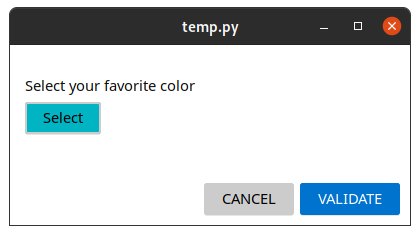
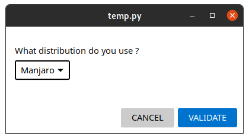
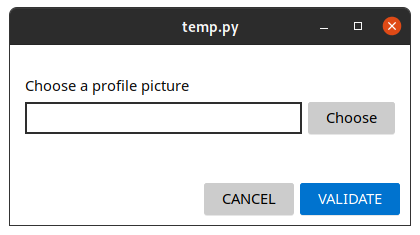
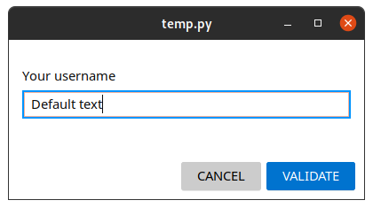
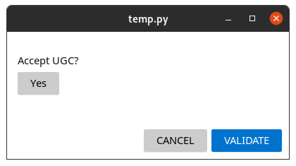

# Forms

A form is a window which contains the fields that you will have specified. It has a validate button, which will return the values ​​of the form as a dictionary, and a cancel button which will return False

### Form props

- **default_size**:[int, int] => The width then the height in pixels of the window when it is launched.
- **theme**:string => The style of the window ([see the styles doc](../style/index.md))
- **resizable**:boolean => True if the user can resize the window
- **fields**:[fields] => Table of fields (see existing fields below)

# Fields

Each field is declared in an element of the fields array.

## Table of Content

- [ColorChooserField](#colorchooserfield)
- [ComboboxField](#comboboxfield)
- [FileChooserField](#filechooserfield)
- [TextField](#textfield)
- [ToggleField](#togglefield)

## Property common to all fields

- **id**:string => Identifier used to retrieve the data
- **label**:string => Field description for the user
- **type**:string => One of the following field types

## ColorChooserField

Opens a color chooser popup.

### Field props
 
- **button**:string => Text displayed on the button
- **format**:string => Color format to use ("hex" or "rgb" or "rgba")
- **default**:string => Default color (must respect the format)

### Return values

Returns a **string**:
- if the format is hex : **#xxxxxx**
- if the format is rgb : **(xxx, xxx, xxx)**
- if the format is rgba : **(xxx, xxx, xxx, xxx)**

### Example

    import pygtk_form

    def show_data(data):
        print(data)

    pygtk_form.spawn_form({
        "default_size": [400, 180],
        "theme": "windows_light",
        "resizable": True,
        "fields": [
            {
                "id": "favouritecolor",
                "type": "colorchooser",
                "label": "Select your favorite color",
                "button": "Select",
                "format": "hex",
                "default": "#00b4c4"
            }
        ]
    }, show_data)

## ComboboxField

Drop-down list of options (ComboBox).

### Field props

- **items**:[{id:string|int, name:string}] => Array of options, name is the text to display, id is the returned identifier
- **default**:string|int => Value selected by default (must be included in the id of the items array)

### Return values

Returns the id of the selected value (**string** or **int**).

### Example

    import pygtk_form

    def show_data(data):
        print(data)

    pygtk_form.spawn_form({
        "default_size": [400, 180],
        "theme": "windows_light",
        "resizable": True,
        "fields": [
            {
                "id": "distribution",
                "type": "combobox",
                "label": "What distribution do you use ?",
                "default": "manjaro",
                "items": [
                    {"id": "fedora", "name": "Fedora"},
                    {"id": "ubuntu", "name": "Ubuntu"},
                    {"id": "debian", "name": "Debian"},
                    {"id": "manjaro", "name": "Manjaro"}
                ]
            }
        ]
    }, show_data)

## FileChooserField

Opens a color chooser popup.

### Field props

- **button**:string => Text displayed on the button
- **filters**:[{ name:string, type: [string] }] => Different file extensions you accept

### Return values

Returns a **string**: the path of the file.

### Example

    import pygtk_form

    def show_data(data):
        print(data)

    pygtk_form.spawn_form({
        "default_size": [400, 180],
        "theme": "windows_light",
        "resizable": True,
        "fields": [
            {
                "id": "profilepicture",
                "type": "filechooser",
                "label": "Choose a profile picture",
                "button": "Choose",
                "filters": [
                    {
                        "name": "Images",
                        "type": ["png", "jpg", "svg", "gif"]
                    }
                ]
            }
        ]
    }, show_data)

## TextField

Basic text field

### Field props

- **text**:string => Text displayed by default
- **max_length**:int => Maximum text size (in number of characters)

### Return values

Returns the **string** typed by the user.

### Example

    import pygtk_form

    def show_data(data):
        print(data)

    pygtk_form.spawn_form({
        "default_size": [400, 180],
        "theme": "windows_light",
        "resizable": True,
        "fields": [
            {
                "id": "pseudo",
                "type": "text",
                "label": "Your username",
                "text": "Default text",
                "max_length": 255
            }
        ]
    }, show_data)

## ToggleField

Toggle button, true or false button

### Field props

- **value**:string => Text displayed in the button
- **default**:boolean => Default value

### Return values

Returns a **$boolean**, True if the button is pressed, False if it is not.

### Example

    import pygtk_form

    def show_data(data):
        print(data)

    pygtk_form.spawn_form({
        "default_size": [400, 180],
        "theme": "windows_light",
        "resizable": True,
        "fields": [
            {
                "id": "accept",
                "type": "toggle",
                "label": "Accept UGC?",
                "value": "Yes",
                "default": False
            }
        ]
    }, show_data)
